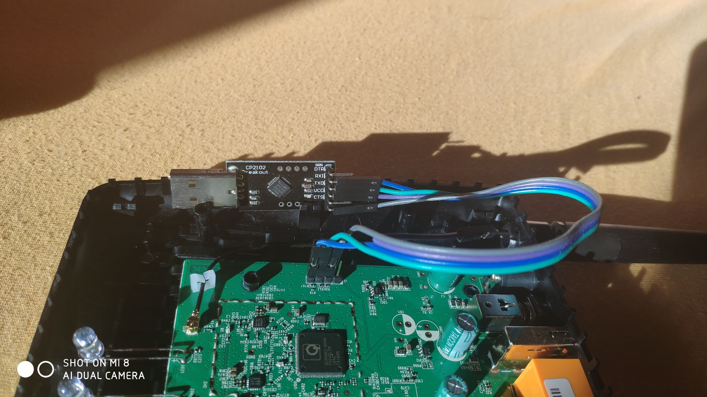

= BringUp OpenWRT to TP-Link D50 v1
:toc:
:numbered:

== Overview
To use OpenWrt on your router, a small hardware modification is required. 
This guide provides step-by-step instructions.

- Open the cover and connect the UART adapter.
- Set up the TFTP server.
- Start the router and verify the UART adapter is working correctly.
- Transfer and flash the OpenWrt image.

== Open Cover
Remove the two screws located behind the label on the underside of the housing. Afterward, you can separate the topside of the housing from the underside. Note: Some force is needed to release all the plastic latches.

== Set Up TFTP Server
A TFTP server is necessary for the update/flash procedure. I used PumpKIN for Windows, which offers an easy and painless setup:

Download the TFTP server application [5] and the OpenWrt image [2] to your Windows workstation. After installing PumpKIN, specify the "TFTP filesystem root" (the location of your OpenWrt image file).

== Connect UART Adapter
I added some pins to the router's PCB to allow connection with a USB/UART adapter. 
See the following picture for details: 
 

== flash procedures
The following instructions require a connection to the J2 UART interface.

Note:
- You need a tftp server for data transfer of the OpenWRT image (openwrt-19.07.2-ath79-generic-tplink_archer-d50-v1-squashfs-sysupgrade.bin).
- You need to connect the ethernet port of the router to your home network.
- The IP address of the tftp server is 192.168.1.32 in my network.

=== Flash instruction under U-Boot, using UART

[code, bash]
----
# set the ip address of tp-link router
setenv ipaddr 192.168.1.101

# set the ip address of tftp router
setenv serverip 192.168.1.32

# transfer openwrt image from tftp server to RAM of router
tftpboot 0x81000000 openwrt-19.07.2-ath79-generic-tplink_archer-d50-v1-squashfs-sysupgrade.bin

# erase partition on router
erase 0x9f020000 +$filesize

# copy openwrt image from RAm to flash filesystem
cp.b 0x81000000 0x9f020000 $filesize

# restart router
reset
----

=== Basic configuration of router
==== Set static IP address

edit file /etc/config/network

[code, bash]
----
config interface 'lan'
        option type 'bridge'
        option ifname 'eth0.1'
        option proto 'static'
        option ipaddr '192.168.1.101'
        option netmask '255.255.255.0'
        option ip6assign '60'
        list dns '8.8.8.8'
        option gateway '192.168.1.1'
----

==== Set dynamic IP address

edit file /etc/config/network

[code, bash]
----
config interface 'lan'
        option device 'br-lan'
        option proto 'dhcp'
----

== Bookmark

  - link:https://git.openwrt.org/?p=openwrt/openwrt.git;a=commit;h=f5d2c91415a68f554815860d574145644fc31c16[[01\] patch with first support and flash instructions]

  - link:http://downloads.openwrt.org/releases/19.07.2/targets/ath79/generic/openwrt-19.07.2-ath79-generic-tplink_archer-d50-v1-squashfs-sysupgrade.bin[[02\] download image v19.07.2]

  - link:https://downloads.openwrt.org/releases/24.10.0/targets/ath79/generic/openwrt-24.10.0-ath79-generic-tplink_archer-d50-v1-squashfs-sysupgrade.bin[[03\] download image v24.10.0]

  - link:https://forum.openwrt.org/t/archer-d50-support/38613[[04\] OpenWrt Forum "Archer D50 Support"]

  - link:https://openwrt.org/toh/hwdata/tp-link/tp-link_archer_d50_v1[[05\] OpenWrt Techdata TP-Link Archer D50 v1]

  - link:http://kin.klever.net/dist/pumpkin-2.7.3-exe.zip[[06\] Pumpkin TFTP Server for Windows]
